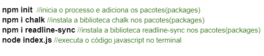

<h1 align="center">

[](https://git.io/typing-svg)

</h1>

<h3>Este projeto organiza as propriedades CSS digitadas pelo usuário em ordem alfabética.</h3>
<hr>
<p>O código foi construído em Javascript e quando executado ele solicita que sejam digitadas as propriedades. Para ver as já inseridas é necessário escrever o comando "mostrar" e para encerrar o laço de repetição digita-se o comando "sair".</p>
<br><br>
<h3 align="center"> Segue abaixo o código:</h3>
<br>


<hr>

<p>Para realizar os testes da applicação, siga os seguintes passos:</p>
<br>
<h3>Clone o Repositório:</h3>

 ```bash
$ git clone https://github.com/afelipinas/projindMod5
 ```

<h3>Abra o Terminal e execute os seguintes códigos:</h3>



<hr>
<h3>Segue abaixo como ficará o teste de execução do código no terminal:</h3>


